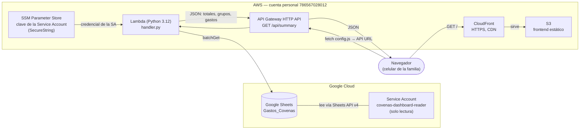
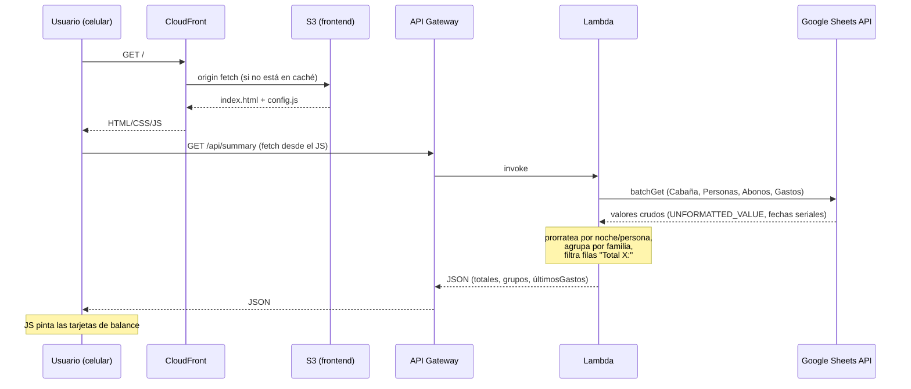
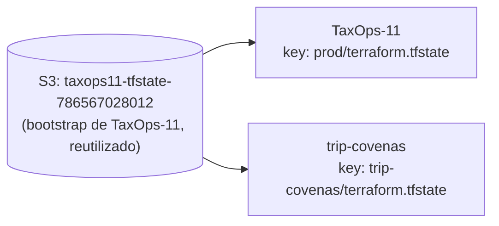
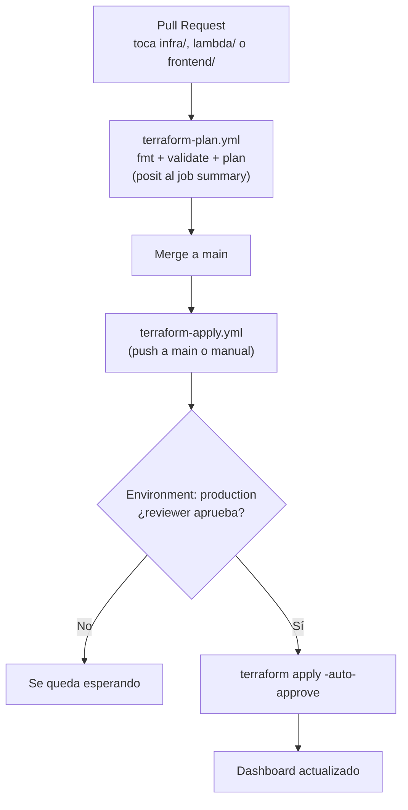

# Arquitectura — Coveñas Trip Dashboard

## Visión general

Google Sheets es la única fuente de verdad de los datos — la familia edita ahí desde el celular.
Todo lo demás (Lambda, API, sitio estático) es una capa de **solo lectura** que transforma esa hoja
en algo agradable de ver, sin que nadie tenga que abrir Excel ni pedirle a alguien que actualice un
resumen a mano.

**Por qué el Sheets sigue siendo la fuente real, y no una base de datos propia:** la familia ya
sabe editar un Sheets desde el celular; no hay que enseñarles una app nueva para registrar un
gasto. La capa de AWS solo existe para dar una vista bonita y viva de esos mismos datos.

## Flujo de una petición

## Lógica de negocio (vive en `lambda/handler.py`, no en el frontend)

El prorrateo se calcula server-side para que el frontend sea una vista tonta — sin esto, cambiar
una fórmula significaría tocar JS además de la hoja.

1. **Tarifa por persona-noche** = `costo total cabaña / Σ(noches de cada persona)`. Así, alguien
   que llega tarde (como Julián) paga menos automáticamente, sin caso especial en el código.
2. **Costo de cada persona** = sus noches × esa tarifa.
3. Se agrupa por `Grupo familiar` y se suma lo que debe el grupo vs. lo que ha abonado (buscado por
   nombre en la hoja `Abonos`).
4. Un grupo se marca `pending: true` si su nota o su etiqueta de grupo indica que no está
   confirmado (heurística genérica, no un nombre hardcodeado).

### Gotcha ya resuelto: filas "Total X:" fantasma

Cada hoja (`Personas`, `Abonos`, `Gastos`) termina con una fila de resumen (`Total
noches-persona:`, `TOTAL ABONADO:`, `TOTAL GASTOS:`) en la misma columna que se usa para detectar
filas de datos válidas. Sin filtrarla, se contaba a sí misma como un dato más — duplicando el total
de noches (tarifa a la mitad) y el total de gastos. `_parse_rows` ahora descarta cualquier fila cuyo
valor en esa columna empiece con "total".

### Gotcha ya resuelto: `cryptography` es un binario, no Python puro

`google-auth` usa `cryptography` (Rust compilado) para firmar el JWT de la Service Account. Un
`pip install` corrido en un Mac empaqueta el binario de macOS, que Lambda (Linux) rechaza con
`invalid ELF header`. El build (`infra/lambda.tf`) fuerza
`--platform manylinux2014_x86_64 --only-binary=:all:` para traer el wheel correcto sin importar
dónde se corra `terraform apply`.

## Seguridad

- **Service Account de solo lectura**: comparte el Sheets como Viewer, no Editor — el Lambda no
  puede escribir aunque quisiera.
- **Clave fuera de Terraform**: la key JSON se sube a SSM Parameter Store (`SecureString`) por
  fuera del apply (`aws ssm put-parameter`); Terraform solo la referencia por ARN vía data source,
  nunca la ve ni la guarda en el state.
- **Sin autenticación en el API**: es de solo lectura, la URL de CloudFront no es adivinable, y los
  datos (cuánto debe cada quien de un viaje familiar) no son sensibles. Mismo modelo de amenaza que
  ya se aceptó cuando esto era un link de Claude Artifact compartido por WhatsApp.
- **Bucket S3 privado**: acceso solo vía CloudFront con Origin Access Control (OAC), no hay lectura
  pública directa del bucket.

## Estado de Terraform

Un solo bucket, dos proyectos, aislados por `key` — sin bootstrap nuevo, sin lock compartido (el
locking nativo de S3 vía `use_lockfile` es por objeto, no por bucket).

## CI/CD

Autenticación por **OIDC** (`aws-actions/configure-aws-credentials` + un IAM role de confianza
scoped a `Portfolio-jaime/trip-covenas`) — ninguna llave de AWS vive como secret de GitHub. El
proveedor OIDC en sí (`token.actions.githubusercontent.com`) es de la cuenta completa y ya existía
por `TaxOps-11`; este proyecto solo agrega su propio *role*, con su propio trust policy — no toca
el de TaxOps.

## Costo

Todo diseñado para quedar dentro de la capa siempre-gratuita de AWS al tráfico de una familia
revisando el celular unas pocas veces al día:

| Servicio | Capa gratuita | Uso real esperado |
|---|---|---|
| Lambda | 1M invocaciones/mes, siempre | Decenas/mes |
| API Gateway (HTTP API) | 1M llamadas/mes (12 meses) | Decenas/mes |
| CloudFront | 1TB salida + 10M requests/mes, siempre | KBs/mes |
| S3 | 5GB + 20k GET (12 meses) | Un `index.html` + `config.js` |
| SSM Parameter Store (Standard) | Gratis | 1 parámetro |

Sin dominio propio (evita Route53 a $0.50/mes), sin nada corriendo 24/7 (no hay servidor ni base de
datos administrada).
